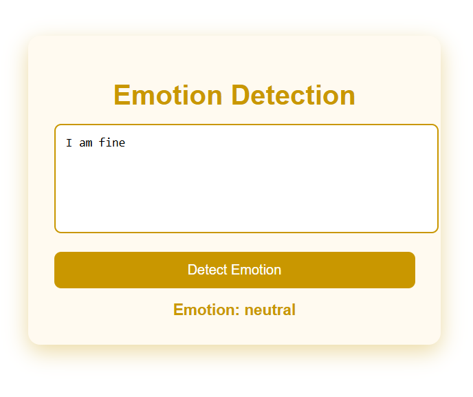

# EmoSense – AI-Powered Emotion Detection from Text

EmoSense is an AI-powered web application that analyzes user-provided text and predicts the underlying emotional state using Natural Language Processing (NLP) and machine learning techniques. The system classifies text into emotions such as anger, happiness, sadness, love and neutrality.

This project demonstrates the complete machine learning workflow, from data preprocessing and model training to deployment through a web-based interface.

### Emotion Prediction

---

## Features
- Text preprocessing using NLP techniques
- TF-IDF vectorization for feature extraction
- Machine learning–based emotion classification
- REST API built with Flask
- End-to-end ML project implementation

---

## Tech Stack
- **Backend:** Python, Flask  
- **Machine Learning:** Scikit-learn, NLTK  
- **Frontend:** HTML, CSS, JavaScript  
- **Modeling:** TF-IDF + Logistic Regression
